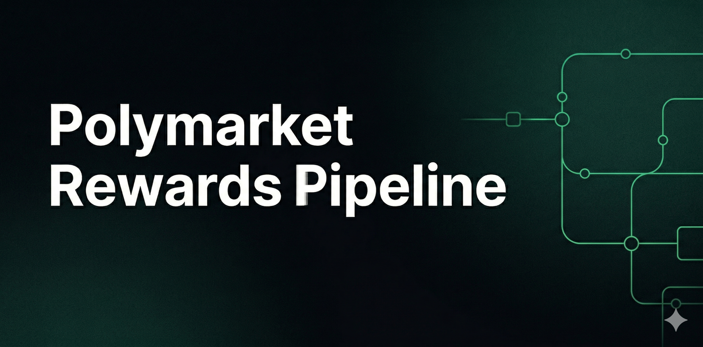
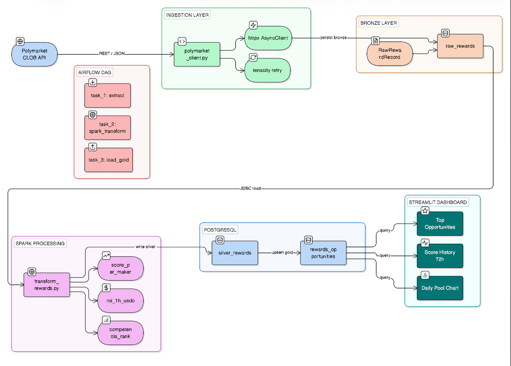

<p align="center">
  
</p>

# Polymarket Rewards Pipeline

[](https://github.com/blackcat112/polymarket-data-pipeline/actions/workflows/ci.yml)
[](https://www.python.org/downloads/release/python-3110/)
[](https://spark.apache.org/)
[](https://airflow.apache.org/)
[](LICENSE)

An end-to-end **Data Engineering pipeline** built around [Polymarket](https://polymarket.com) — the largest on-chain prediction market platform.

The project originated as a live market-making bot that placed limit orders on both sides of the spread to earn USDC liquidity rewards. It has been refactored into a production-grade data pipeline covering the full data lifecycle: async ingestion from the CLOB API, batch transformation with Apache Spark, hourly orchestration via Apache Airflow, and a real-time Streamlit dashboard for analytical monitoring.

---

## Pipeline Architecture

## Pipeline Architecture

<p align="center">
  
</p>

Data flows through three explicit quality tiers — **bronze → silver → gold** — following the medallion architecture pattern used in production data platforms.

---

## What Polymarket Is

Polymarket is a prediction market built on the Polygon blockchain. Participants trade shares in binary outcomes: a share pays $1.00 if the event resolves YES and $0.00 if NO. The current price (between $0.01–$0.99) is the crowd's implied probability.

The platform exposes a Central Limit Order Book (CLOB) API that provides live order books, historical prices, market metadata, and **liquidity reward pools** — periodic USDC distributions paid to market makers who maintain tight spreads. This pipeline is focused on discovering, scoring, and tracking those reward opportunities.

---

## Pipeline Layers

### Layer 1 — Ingestion (Bronze)

The ingestion module polls the Polymarket CLOB API every hour via `httpx.AsyncClient` with `asyncio.gather` for concurrent requests. Transient failures are handled by `tenacity` with exponential backoff. Every response is written as-is to `raw_rewards` (the bronze table), preserving the full API payload for reprocessability.

Key models — defined in `ingestion/models.py`:
- **`RewardMarket`** — a scored market eligible for liquidity rewards (`score`, `roi_1h_usdc`, `pool_diario`, `num_makers`, `max_spread`)
- **`RawRewardRecord`** — the bronze-layer DTO stored verbatim in PostgreSQL with a `fetched_at` timestamp

### Layer 2 — Processing (Silver / Gold)

A PySpark batch job (`spark/jobs/transform_rewards.py`) reads `raw_rewards`, parses the JSON payloads, applies scoring, and writes two output tables:

| Output | Layer | Description |
|--------|-------|-------------|
| `silver_rewards` | Silver | Parsed rows with all computed metrics appended |
| `rewards_opportunities` | Gold | One row per market, upserted — latest state for the dashboard |

Metrics computed per market:
- **`score_per_maker`** — `pool_diario / max(num_makers, 1)` — profitability per maker competing in this market
- **`roi_1h_usdc`** — `score_per_maker / 24` — estimated USDC earnings per hour
- **`competencia_rank`** — rank by score within each snapshot, using PySpark `Window`
- **`simulated_rewards_7d / 24h`** — historical reward simulation for backtesting
- **`avg_score_7d`** — rolling 7-day average score for trend analysis

### Layer 3 — Orchestration

An Airflow DAG (`airflow/dags/rewards_pipeline.py`) runs on an `@hourly` schedule and chains three tasks:

```
extract_rewards  ──▶  spark_transform  ──▶  load_gold_layer
```

1. **`extract_rewards`** — calls the ingestion module, persists bronze records, returns a run summary via XCom
2. **`spark_transform`** — submits `transform_rewards.py` via `spark-submit` using `BashOperator`
3. **`load_gold_layer`** — upserts `rewards_opportunities` from the silver layer, making results immediately available to the dashboard

The DAG uses the TaskFlow API (`@task` decorators), producing plain Python functions testable in isolation, with retries and exponential backoff configured at the DAG level.

### Layer 4 — Dashboard

A Streamlit application (`dashboard/demo.py`) auto-refreshes every 60 seconds and displays:
- **Top reward opportunities** ranked by `score_per_maker`
- **Daily pool distribution** by market (bar chart, colour-coded by score)
- **Score/maker 72h history** with `roi_1h_usdc` overlay per selected market
- **KPIs** — active markets, total daily pool, best ROI/hour, simulated 7-day rewards

---

## Tech Stack

| Layer | Technology |
|---|---|
| Language | Python 3.11 |
| Ingestion | httpx 0.27, asyncio, tenacity 8 |
| Data models | dataclasses + type hints |
| Processing | Apache Spark 3.5 (PySpark) |
| Orchestration | Apache Airflow 2.9 (LocalExecutor) |
| Storage | PostgreSQL 16 |
| Dashboard | Streamlit 1.35, Plotly 5 |
| Infrastructure | Docker Compose v2 |
| Logging | structlog (JSON structured output) |
| Testing | pytest 8, pytest-asyncio, pytest-cov |
| Code quality | ruff, mypy (strict) |

---

## Project Structure

```
polymarket-data-pipeline/
├── .github/
│   └── workflows/
│       └── ci.yml                       # Lint + type check + tests on every push
├── airflow/
│   └── dags/
│       └── rewards_pipeline.py          # Hourly DAG: extract → spark → load
├── dashboard/
│   ├── Dockerfile                       # Minimal python:3.11-slim image
│   ├── app.py                           # Streamlit (PostgreSQL mode)
│   └── demo.py                          # Streamlit (synthetic data, no DB)
├── database/
│   └── migrations/
│       ├── 001_rewards_schema.sql        # Bronze + silver tables
│       └── 002_rewards_schema.sql        # Gold layer + indexes
├── ingestion/
│   ├── models.py                        # RewardMarket, RawRewardRecord dataclasses
│   ├── polymarket_client.py             # Async CLOB API client
│   ├── db.py                            # PostgreSQL persistence (bronze layer)
│   └── tests/
│       └── test_models.py               # 6 unit tests, no DB required
├── modules/                             # Original trading bot (reference only)
├── spark/
│   ├── jobs/
│   │   └── transform_rewards.py         # PySpark: parse → score → rank → write
│   └── tests/
│       └── test_transform_rewards.py    # 7 unit tests, local SparkSession
├── .env.example
├── docker-compose.yml                   # 6 services: postgres, airflow, spark ×2, dashboard
├── pyproject.toml
├── requirements-dashboard.txt
└── CHANGELOG.md
```

---

## Quick Start

### Full stack with Docker

```bash
git clone https://github.com/blackcat112/polymarket-data-pipeline.git
cd polymarket-data-pipeline
cp .env.example .env
docker compose up --build -d
```

| Service | URL | Credentials |
|---|---|---|
| Airflow webserver | http://localhost:8080 | admin / admin |
| Spark master UI | http://localhost:8081 | — |
| Streamlit dashboard | http://localhost:8501 | — |
| PostgreSQL | localhost:5432 | see `.env` |

The pipeline runs automatically on the `@hourly` schedule. To trigger it manually, open the Airflow UI and click **Trigger DAG** on `rewards_pipeline`.

### Demo mode (no Docker required)

```bash
pip install streamlit plotly pandas
streamlit run dashboard/demo.py
```

Opens at `http://localhost:8501` with synthetic data — no PostgreSQL or Spark needed.

### Run tests

```bash
pip install -e ".[dev]"
pytest --cov=ingestion --cov=spark --cov-report=term-missing
```

---

## Design Decisions

**httpx over requests**
`requests` has no native async support. `httpx` provides an identical API surface with full `asyncio` compatibility, making it the natural choice for the ingestion layer where concurrent market fetches are required.

**Medallion architecture in PostgreSQL**
Keeping bronze, silver, and gold layers in a single PostgreSQL instance simplifies the local environment without sacrificing architectural clarity. In a production setting, the silver layer would move to a columnar store (Redshift, BigQuery) or object storage with Delta Lake.

**PySpark for modest data volumes**
Polymarket data does not require distributed processing in practice. PySpark is used deliberately to demonstrate familiarity with the DataFrame API, `Window` functions, and `spark-submit` — patterns that apply directly at scale in production platforms.

**`score_per_maker` as the core metric**
Raw `pool_diario` (total daily rewards) is misleading: a high pool shared among 20 makers is worse than a moderate pool with 2 makers. Dividing by `max(num_makers, 1)` normalises the opportunity and prevents division-by-zero — a deliberate defensive choice tested explicitly in the test suite.

**TaskFlow API in Airflow**
The DAG uses `@task` decorators instead of classic Operators. This reduces boilerplate, makes each task a plain Python function testable in isolation, and passes data between tasks via return values rather than manual `xcom_push/pull`.

**structlog for structured logging**
All modules emit JSON-formatted log records, making logs directly ingestible by aggregation tools (Datadog, Loki, CloudWatch) without additional parsing.

---

## Status

| Component | Status |
|---|---|
| Ingestion layer (bronze) | ✅ Complete |
| Spark processing (silver / gold) | ✅ Complete |
| Airflow DAG | ✅ Complete |
| Streamlit dashboard | ✅ Complete |
| Docker Compose (6 services) | ✅ Complete |
| Unit tests (CI green) | ✅ Complete |
